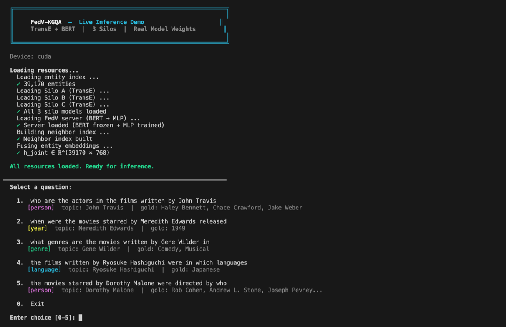
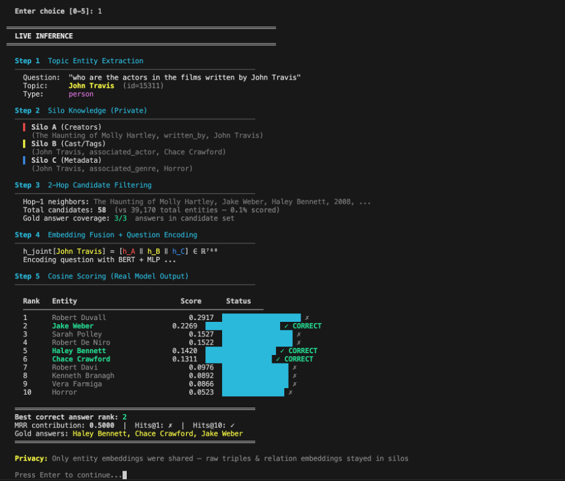
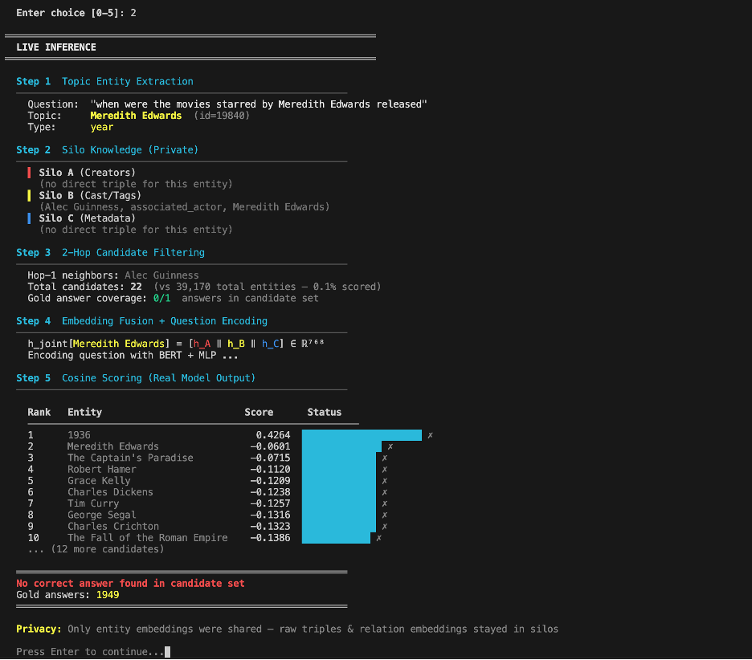
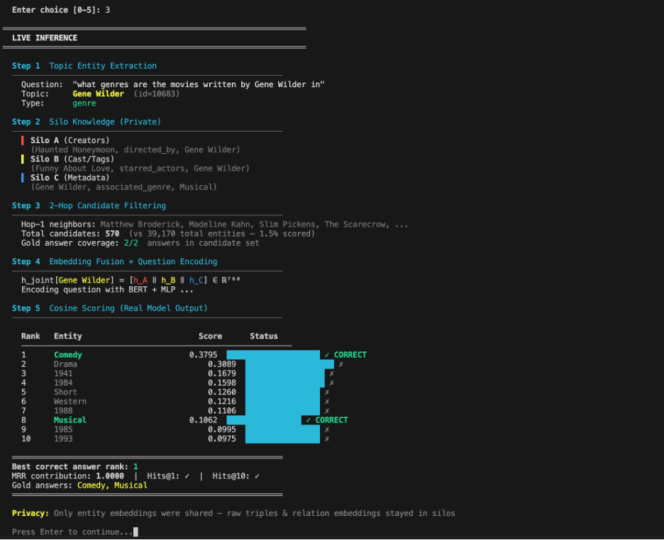
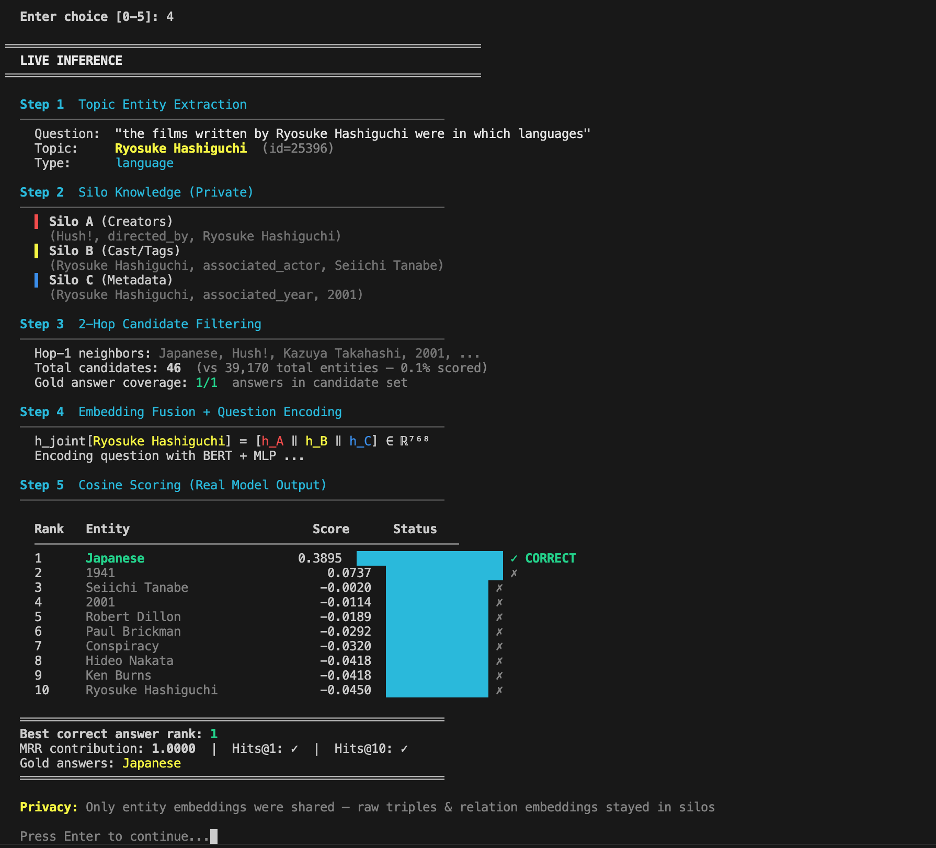
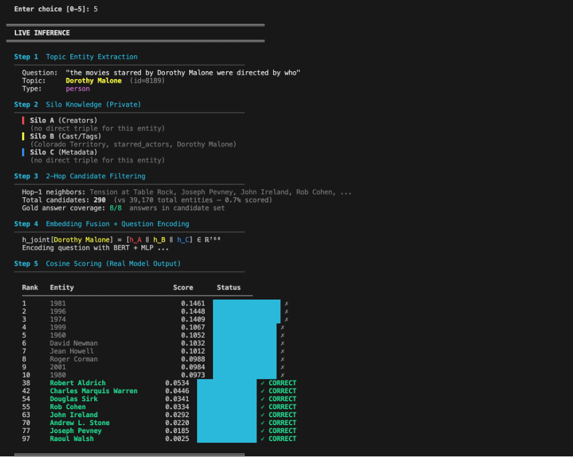
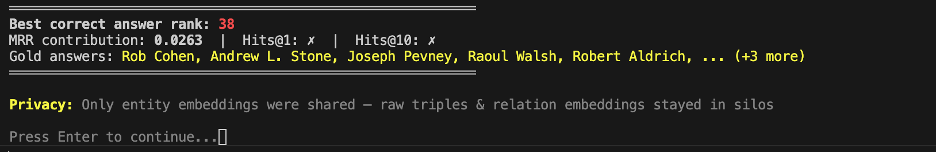

# Demo Description

## Figure 1: System Initialization

This figure shows the FedV-KGQA demo starting up with the TransE + BERT configuration over 3 silos using trained model weights. The system loads 39,170 entities, all three silo models, the FedV server with frozen BERT and trained MLP, and builds the neighbor index. It then fuses entity embeddings into a joint matrix of shape 39170 × 768 and presents five sample 2-hop questions.

## Figure 2: Question 1, Actors in Films Written by John Travis

This figure demonstrates a 2-hop question where the topic entity John Travis is identified in Silo A through the `written_by` relation. Silo A contains the writing fact, Silo B contains cast information, and Silo C contains genre information. After 2-hop candidate filtering, the search space is reduced to 58 entities out of 39,170. The model retrieves all three gold answers within the top 6, producing an MRR of 0.5000 and a successful Hits@10 result.

## Figure 3: Question 2, Release Year of Movies Starred by Meredith Edwards

This figure shows a failure case where the gold answer, 1949, is not present in the candidate set. The topic entity Meredith Edwards has no direct triple in Silo A or Silo C and only has an actor link in Silo B. As a result, the 2-hop expansion produces 22 candidates but misses the correct release year. This case illustrates the limitation when relevant facts are not reachable within two hops in the enriched graph.

## Figure 4: Question 3, Genres of Movies Written by Gene Wilder

This figure shows a strong success case. The topic entity Gene Wilder appears in all three silos, providing rich silo coverage. The system filters the search space to 570 candidates and ranks `Comedy` at position 1 and `Musical` at position 8. Both gold answers are correctly retrieved, producing an MRR of 1.0000 and successful Hits@1 and Hits@10 results.

## Figure 5: Question 4, Languages of Films Written by Ryosuke Hashiguchi

This figure shows another perfect retrieval case. The topic entity has triples in all three silos, including the written film `Hush!`, the actor `Seiichi Tanabe`, and the year `2001`. After filtering to 46 candidates, the model ranks `Japanese` at position 1 with a clear score gap. This produces an MRR of 1.0000 and confirms effective cross-silo reasoning when the topic entity is well connected.

## Figures 6 and 7: Question 5, Directors of Movies Starred by Dorothy Malone

These figures show a hard case with many gold answers. The topic entity Dorothy Malone appears only in Silo B, so the initial silo coverage is limited. After 2-hop expansion, the candidate set grows to 290 entities and covers all 8 gold answer directors. However, the model ranks the first correct director, `Robert Aldrich`, only at position 38, while the remaining correct directors appear further down. The final MRR is 0.0263, showing that questions with sparse silo presence and many valid answers remain challenging.
